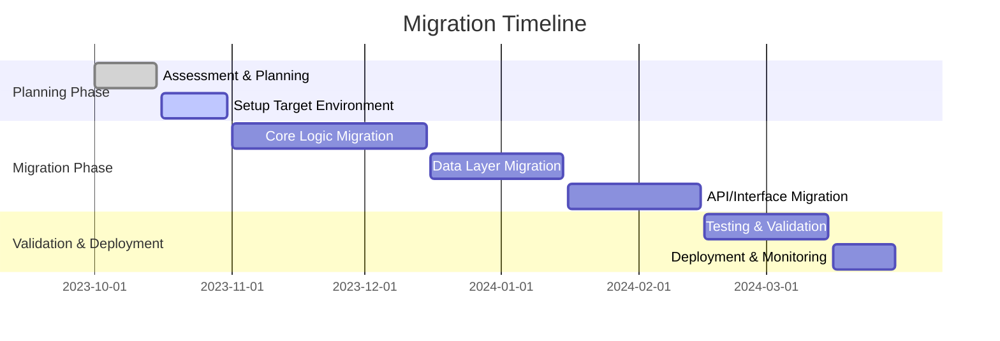

# MIGRATION_PLAN.md

## Executive Summary

This document outlines the comprehensive plan for migrating the `repository` project from **C#** to **Java**. The migration is necessary to align with organizational goals of adopting a unified tech stack, improving long-term maintainability, and leveraging Java's ecosystem for enterprise applications. This plan provides a step-by-step guide, addressing technical, operational, and business considerations to ensure the migration is successful, with minimal disruption and maximum value.

---

## Migration Strategy Overview

The migration will follow a **phased approach** to reduce risk and maintain functionality during the transition. The seven primary phases are:

1. **Assessment & Planning**: Understanding the project's architecture, dependencies, and critical components.
2. **Setup Target Environment**: Establishing the Java-based development environment, including tools, frameworks, and configurations.
3. **Core Logic Migration**: Translating core business logic and adapting data structures from C# to Java.
4. **Data Layer Migration**: Migrating database models and queries to Java-compatible frameworks like Hibernate or JPA.
5. **API/Interface Migration**: Porting API endpoints, routing, and middleware.
6. **Testing & Validation**: Ensuring the migrated code meets functional, integration, and performance requirements.
7. **Deployment & Monitoring**: Deploying the migrated application to production and ensuring stability.

---

## Detailed Migration Plan

### **Step 1: Assessment & Planning**
#### Description:
Analyze the current codebase, identify dependencies, and establish a migration strategy.

#### Tasks:
- **Document Current Architecture**: Create diagrams showing the existing architecture, including components, dependencies, and workflows.
- **List All Dependencies**: Identify third-party libraries, frameworks, and custom components in use.
- **Identify Critical Components**: Highlight business-critical modules that require special attention during migration.

#### Technical Requirements:
- Tools: Architecture documentation tools like UML, Lucidchart.
- Deliverables: Comprehensive architecture documentation, dependency list, and a prioritized component list.

#### Risks & Mitigation:
| Risk                          | Likelihood | Impact | Mitigation Strategy                                   |
|-------------------------------|------------|--------|------------------------------------------------------|
| Missing critical dependencies | Medium     | High   | Conduct thorough dependency analysis.                |
| Overlooking edge cases        | Medium     | High   | Engage domain experts in the assessment process.     |

#### Milestone:
- Completion of architecture and dependency documentation.

---

### **Step 2: Setup Target Environment**
#### Description:
Prepare the Java development environment, including tools, frameworks, and configurations.

#### Tasks:
- **Install Language/Framework**: Set up Java (JDK 17 or latest LTS), Spring Boot, and any required libraries.
- **Setup Project Structure**: Define a Maven/Gradle-based project structure mirroring the original structure.
- **Configure Build Tools**: Set up Gradle/Maven for dependency management and builds.

#### Technical Requirements:
- Tools: JDK 17+, IntelliJ IDEA/Eclipse, Maven or Gradle, Docker (for containerized development).
- Deliverables: Initialized Java repository with sample builds.

#### Risks & Mitigation:
| Risk               | Likelihood | Impact | Mitigation Strategy                |
|--------------------|------------|--------|-------------------------------------|
| Misconfigured tools | Low        | Medium | Use standard configurations and CI. |

#### Milestone:
- Development environment ready for migration.

---

### **Step 3: Core Logic Migration**
#### Description:
Translate the core business logic and algorithms from C# to Java.

#### Tasks:
1. **Translate Core Functions**: Implement equivalent Java versions of C# methods.
   - Example Conversion:
     ```csharp
     // C# Code
     public string Greet(string name) {
         return $"Hello, {name}!";
     }
     ```
     ```java
     // Java Code
     public String greet(String name) {
         return "Hello, " + name + "!";
     }
     ```
2. **Adapt Data Structures**: Use Java collections (e.g., `ArrayList`, `HashMap`) to replace .NET collections.
3. **Port Algorithms**: Migrate algorithms, ensuring compatibility with Java's features.

#### Technical Requirements:
- Tools: Static code analysis tools like SonarQube.
- Deliverables: Core logic implemented and reviewed.

#### Risks & Mitigation:
| Risk                      | Likelihood | Impact | Mitigation Strategy                            |
|---------------------------|------------|--------|-----------------------------------------------|
| Logic discrepancies       | Medium     | High   | Write unit tests for every translated method. |

#### Milestone:
- Completion of core logic migration.

---

### **Step 4: Data Layer Migration**
#### Description:
Convert database models and queries to Java-compatible ORM frameworks.

#### Tasks:
- **Port Database Schema**: Translate Entity Framework models to Hibernate/JPA.
- **Convert ORM/Queries**: Rewrite LINQ queries in JPQL or Criteria API.
- **Migrate Data Access Layer**: Adapt the repository pattern to use Java's ORM.

#### Technical Requirements:
- Tools: Hibernate, MySQL driver for Java.
- Deliverables: Fully migrated database access layer.

#### Risks & Mitigation:
| Risk                | Likelihood | Impact | Mitigation Strategy                          |
|---------------------|------------|--------|---------------------------------------------|
| Query performance   | Medium     | High   | Optimize queries during migration.          |

#### Milestone:
- Database layer operational in Java.

---

### **Step 5: API/Interface Migration**
#### Description:
Port API endpoints, routing, and middleware to Java (Spring Boot).

#### Tasks:
- **Port API Routes**: Map ASP.NET routes to Spring Boot controllers.
- **Convert Request/Response Handlers**: Adapt models and JSON serialization.
- **Adapt Middleware**: Replace .NET middleware with Spring's interceptor/filter equivalents.

#### Technical Requirements:
- Frameworks: Spring Boot, Jackson (for JSON).
- Deliverables: Functional APIs in Java.

#### Risks & Mitigation:
| Risk              | Likelihood | Impact | Mitigation Strategy                       |
|-------------------|------------|--------|------------------------------------------|
| API incompatibility | Medium     | High   | Use Postman tests to validate endpoints. |

#### Milestone:
- All API endpoints migrated and tested.

---

### **Step 6: Testing & Validation**
#### Description:
Ensure the migrated code meets functionality, integration, and performance requirements.

#### Tasks:
- **Write/Port Unit Tests**: Translate NUnit tests to JUnit.
- **Integration Testing**: Test interactions between modules.
- **Performance Testing**: Benchmark Java services against original C# implementations.

#### Technical Requirements:
- Tools: JUnit, Mockito, Postman, JMeter.
- Deliverables: Test reports and performance benchmarks.

#### Risks & Mitigation:
| Risk                    | Likelihood | Impact | Mitigation Strategy                |
|-------------------------|------------|--------|-------------------------------------|
| Bugs in migrated code   | High       | High   | Perform thorough testing.           |

#### Milestone:
- Test coverage > 90%, with all critical tests passed.

---

### **Step 7: Deployment & Monitoring**
#### Description:
Deploy the migrated application to production and monitor its performance.

#### Tasks:
- **Setup CI/CD**: Automate builds, tests, and deployments using Jenkins or GitHub Actions.
- **Deploy to Staging**: Test the application in a staging environment.
- **Monitor and Optimize**: Use tools like Prometheus, Grafana for monitoring.

#### Technical Requirements:
- Tools: Docker, Kubernetes, CI/CD pipelines.
- Deliverables: Production-ready deployment.

#### Risks & Mitigation:
| Risk                   | Likelihood | Impact | Mitigation Strategy                   |
|------------------------|------------|--------|----------------------------------------|
| Deployment failures    | Medium     | High   | Test deployments in staging thoroughly. |

#### Milestone:
- Application deployed to production.

---

## Timeline and Milestones


---

## Resource Requirements
- **Human Resources**: 1 architect, 2 senior Java developers, 1 database expert, 1 QA engineer.
- **Technical Resources**: Development tools (IntelliJ, JDK), testing frameworks, and cloud environments.

---

## Success Criteria and Metrics
- Functional parity between C# and Java applications.
- Test coverage > 90%.
- API response times within acceptable limits (<200ms).
- Zero critical bugs post-deployment.

---

## Rollback Procedures
1. Maintain the C# application as the fallback.
2. Use feature flags to toggle between versions.
3. Implement database rollback scripts for schema changes.

---

## Post-Migration Validation Checklist
- [ ] All unit and integration tests passed.
- [ ] Performance benchmarks validated.
- [ ] Production deployment verified.
- [ ] Monitoring alerts configured.

---

By adhering to this plan, the migration from C# to Java will be efficient, systematic, and successful.