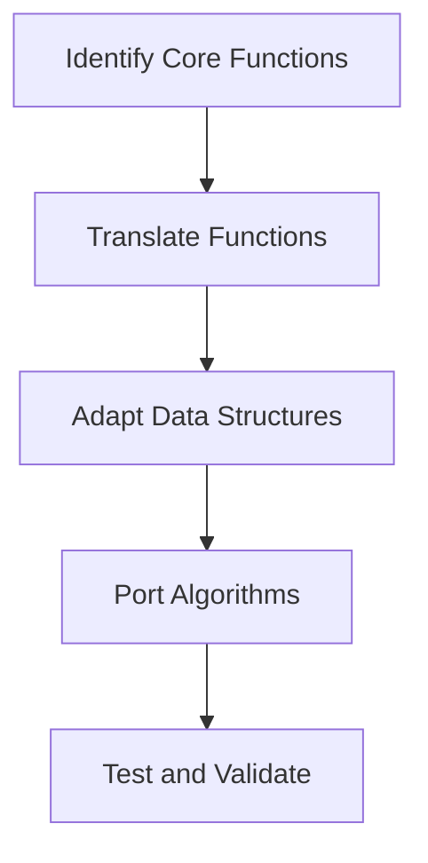

# Migration Step 3: Core Logic Migration

## Step Overview and Objectives
### Overview
The **Core Logic Migration** step involves converting the core business logic and algorithms from C# to Java. This is arguably the most critical phase in the migration process since the core logic drives the application's functionality. Accuracy, performance, and maintainability must be key priorities during this step.

### Objectives
- **Translate Core Functions:** Rewrite core methods and business logic written in C# into Java.
- **Adapt Data Structures:** Replace C# data structures with their Java equivalents.
- **Port Algorithms:** Ensure that algorithms function identically in Java, preserving performance and behavior.

---

## Prerequisites and Dependencies
Before starting this step, ensure the following prerequisites are met:
1. **Environment Setup:**
   - Java Development Kit (JDK) installed (minimum version 11 recommended).
   - IDE ready (e.g., IntelliJ IDEA or Eclipse).
   - Access to the source C# code repository.
2. **Completed Migration Steps:**
   - Step 1: **Project Setup Migration.**
   - Step 2: **Dependency Mapping and Libraries Migration.**
3. **Understanding of Core Logic:**
   - A thorough understanding of the existing business logic in C#.
   - Documentation available for all methods and algorithms.
   - Unit tests available in the C# repository for validation.
4. **Dependencies:**
   - Java libraries equivalent to C# libraries for data handling, threading, or other core functionality.

---

## Detailed Implementation Instructions

### Task 1: Translate Core Functions
1. **Identify Core Functions:**
   - Locate and list all core methods in the C# repository classified as "business logic."
   - Use tools like dependency graphs or code analysis tools to identify function dependencies.

2. **Convert Function Signatures:**
   - Match C# method signatures with Java equivalents. 
   - Example:
     ```csharp
     // C# Method
     public int CalculateSum(int a, int b)
     {
         return a + b;
     }
     ```
     ```java
     // Java Equivalent
     public int calculateSum(int a, int b) {
         return a + b;
     }
     ```

3. **Handle Language-Specific Constructs:**
   - Replace C#-specific keywords and constructs with their Java counterparts:
     - `async`/`await` → Java's `CompletableFuture` or `ExecutorService`.
     - `var` → Explicit type declarations (or Java's `var` in Java 10+).
     - `out` and `ref` → Use return values or `AtomicReference`.

4. **Code Example:**
   ```csharp
   // C# Code
   public bool IsEligible(int age)
   {
       return age >= 18;
   }
   ```
   ```java
   // Java Code
   public boolean isEligible(int age) {
       return age >= 18;
   }
   ```

---

### Task 2: Adapt Data Structures
1. **Mapping Data Structures:**
   - Replace C# data types with equivalent Java types:
     | C# Type         | Java Equivalent            |
     |------------------|----------------------------|
     | `List<T>`       | `ArrayList<T>`             |
     | `Dictionary<K,V>`| `HashMap<K,V>`            |
     | `HashSet<T>`    | `HashSet<T>`              |
     | `Queue<T>`      | `LinkedList<T>`           |

2. **Example:**
   ```csharp
   // C# Data Structure
   List<string> names = new List<string> { "Alice", "Bob" };
   ```
   ```java
   // Java Data Structure
   List<String> names = new ArrayList<>(Arrays.asList("Alice", "Bob"));
   ```

3. **Null Handling:**
   - Java lacks `Nullable<T>` directly. Use `Optional<T>` where appropriate.

---

### Task 3: Port Algorithms
1. **Algorithm Translation:**
   - Translate algorithms line by line while ensuring identical functionality.
   - Perform optimization if needed (e.g., Java provides better threading mechanisms like `ForkJoinPool`).

2. **Code Example:**
   ```csharp
   // C# Bubble Sort
   public void BubbleSort(int[] arr)
   {
       for (int i = 0; i < arr.Length - 1; i++)
       {
           for (int j = 0; j < arr.Length - i - 1; j++)
           {
               if (arr[j] > arr[j + 1])
               {
                   int temp = arr[j];
                   arr[j] = arr[j + 1];
                   arr[j + 1] = temp;
               }
           }
       }
   }
   ```
   ```java
   // Java Bubble Sort
   public void bubbleSort(int[] arr) {
       for (int i = 0; i < arr.length - 1; i++) {
           for (int j = 0; j < arr.length - i - 1; j++) {
               if (arr[j] > arr[j + 1]) {
                   int temp = arr[j];
                   arr[j] = arr[j + 1];
                   arr[j + 1] = temp;
               }
           }
       }
   }
   ```

3. **Threading and Concurrency:**
   - Replace C# `Task` with Java’s `CompletableFuture` or `ExecutorService`.

---

## Common Pitfalls and How to Avoid Them
1. **NullPointerException:**
   - Java does not treat `null` safely like C# does. Use `Objects.requireNonNull()` or `Optional<T>`.

2. **IndexOutOfBoundsException:**
   - Ensure array and list indices are properly checked during conversions.

3. **Performance Differences:**
   - Java's `StringBuilder` is not thread-safe. Use `StringBuffer` if multithreading is involved.

4. **Incorrect Data Type Conversion:**
   - Be mindful of implicit conversions in C# that Java doesn’t support.

---

## Testing Checklist
- [ ] Unit tests for all migrated functions pass.
- [ ] Edge cases (e.g., null inputs, empty collections) are tested.
- [ ] Algorithms produce identical results when tested with the same input as C#.
- [ ] Performance benchmarks are within acceptable limits.

---

## Validation Criteria
- Core functions in Java are logically identical to their C# counterparts.
- Data structures are properly adapted, and no functionality is lost.
- All unit and integration tests pass.

---

## Troubleshooting Guide
1. **Logic Errors:**
   - Double-check algorithm translations.
   - Use debug tools in your IDE to step through the code.

2. **Performance Issues:**
   - Profile the Java application using tools like VisualVM or JProfiler.
   - Optimize expensive calls or replace them with Java-native APIs.

3. **Threading Issues:**
   - Verify thread-safety when porting multi-threaded logic.
   - Replace C# locks (`lock` keyword) with Java’s `synchronized` blocks or `ReentrantLock`.

---

## Resources and References
- [Java Documentation](https://docs.oracle.com/en/java/)
- [C# to Java Conversion Tips](https://www.baeldung.com/cs-to-java)
- [Java Optional Guide](https://www.baeldung.com/java-optional)

---

## Next Steps
After completing the core logic migration:
- Proceed to **Step 4: Integration and API Migration.**
- Begin integrating the migrated core logic with other application layers.

---

> ### Time Estimate
> - **Small Project:** 4-6 hours
> - **Medium Project:** 2-3 days
> - **Large Project:** 1-2 weeks

---

### Diagram: Simplified Migration Workflow
