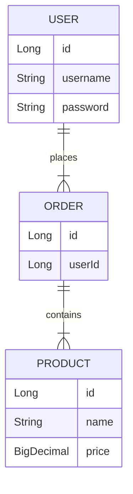

# Detailed Implementation Guide: Step 4 - Data Layer Migration

---

## **Step Overview and Objectives**

### Objective:
The goal of this step is to migrate the data layer from C# to Java, ensuring that the database schema, ORM (Object-Relational Mapping) models, queries, and data access logic are ported successfully without introducing inconsistencies or performance issues. This involves:
- Porting database schema definitions.
- Converting ORM models and queries.
- Migrating the data access layer to Java frameworks while maintaining business logic integrity.

---

## **Prerequisites and Dependencies**

### Prerequisites:
1. **Environment Setup**: Ensure the target Java environment is ready, including relevant frameworks like Hibernate or JPA.
2. **Database Configuration**: Confirm the database server (e.g., SQL Server, MySQL, PostgreSQL) is accessible.
3. **Source Code Access**: Access to the C# codebase with database models and queries.
4. **Migration Plan**: A clear understanding of the database schema, relationships, and mappings.
5. **Dependency Libraries**: Install ORM libraries such as Hibernate, JPA, or Spring Data JPA in the Java project.

### Dependencies:
- **Step 3 Completion**: Ensure that business logic migration is complete before migrating the data layer.
- **Database Drivers**: Install and configure database drivers for the Java application (e.g., `mysql-connector-java`, `postgresql`).

---

## **Detailed Implementation Instructions**

### **Task 1: Port Database Schema**
1. **Export the Schema**:
   - Use tools like SQL Server Management Studio or MySQL Workbench to export the existing database schema.
   - Save the schema in SQL format for reference.

2. **Review Schema for Compatibility**:
   - Check for differences in data types between C# and Java ORM libraries (e.g., `nvarchar` in SQL maps to `String` in Java).
   - Update any incompatible types or constraints during migration.

3. **Generate Java Entities**:
   - Use Hibernate's reverse-engineering tools if supported, or manually create entity classes based on the schema.

```java
@Entity
@Table(name = "users")
public class User {
    @Id
    @GeneratedValue(strategy = GenerationType.IDENTITY)
    private Long id;

    @Column(name = "username", nullable = false, unique = true)
    private String username;

    @Column(name = "password", nullable = false)
    private String password;

    // Add other fields and relationships here
}
```

### **Task 2: Convert ORM Models and Queries**
1. **Map Relationships**:
   - Convert C# `Entity Framework` relationships (e.g., `One-to-Many`, `Many-to-Many`) to JPA annotations (`@OneToMany`, `@ManyToOne`, etc.).

```csharp
// C# Entity Framework
public class Order {
    public int Id { get; set; }
    public ICollection<Product> Products { get; set; }
}

// Java JPA equivalent
@Entity
@Table(name = "orders")
public class Order {
    @Id
    @GeneratedValue(strategy = GenerationType.IDENTITY)
    private Long id;

    @OneToMany(mappedBy = "order", cascade = CascadeType.ALL)
    private List<Product> products;
}
```

2. **Rewrite Queries**:
   - Replace LINQ queries with equivalent JPQL (Java Persistence Query Language) or Criteria API.

```csharp
// C# LINQ Query
var users = db.Users.Where(u => u.IsActive).ToList();

// Java JPQL Query
TypedQuery<User> query = entityManager.createQuery("SELECT u FROM User u WHERE u.isActive = true", User.class);
List<User> users = query.getResultList();
```

3. **Handle Stored Procedures**:
   - If stored procedures are used, adapt them using Hibernate's `@NamedStoredProcedureQuery` or plain JDBC.

```java
@NamedStoredProcedureQuery(
    name = "getActiveUsers",
    procedureName = "GetActiveUsers",
    resultClasses = User.class
)
```

### **Task 3: Migrate Data Access Layer**
1. **Implement Repository Interfaces**:
   - Replace C# `Repository` patterns with Java equivalents like Spring Data JPA repositories.

```java
public interface UserRepository extends JpaRepository<User, Long> {
    List<User> findByIsActiveTrue();
}
```

2. **Refactor Service Logic**:
   - Update service classes to use the new Java repositories instead of the C# data access layer.

3. **Test Connection**:
   - Verify that the database connection is working by running a simple query.

---

## **Code Examples and Snippets**

### Example: Migrating a C# Entity to Java
#### C# Entity Framework
```csharp
public class Product {
    public int Id { get; set; }
    public string Name { get; set; }
    public decimal Price { get; set; }
}
```

#### Java JPA Entity
```java
@Entity
@Table(name = "products")
public class Product {
    @Id
    @GeneratedValue(strategy = GenerationType.IDENTITY)
    private Long id;

    @Column(name = "name", nullable = false)
    private String name;

    @Column(name = "price", nullable = false)
    private BigDecimal price;
}
```

---

## **Common Pitfalls and How to Avoid Them**

### Pitfall 1: Data Type Mismatch
- **Solution**: Consult the database documentation and ORM library documentation to ensure proper type mapping.

### Pitfall 2: Missing Relationships
- **Solution**: Carefully analyze the source code and schema to ensure relationships are correctly mapped.

### Pitfall 3: Query Performance Issues
- **Solution**: Optimize queries during migration using database indexes and efficient JPQL syntax.

---

## **Testing Checklist**

1. Verify schema compatibility with the database engine.
2. Test entity mappings and relationships using unit tests.
3. Execute basic CRUD operations and validate results.
4. Run all stored procedures and ensure expected outputs.
5. Stress-test complex queries for performance.

---

## **Validation Criteria**

- All entities and relationships are correctly mapped in Java.
- Queries return the expected results.
- CRUD operations work without errors.
- Data integrity is maintained post-migration.

---

## **Troubleshooting Guide**

### Issue: Connection Failure
- **Solution**: Verify database credentials, driver configuration, and firewall settings.

### Issue: Incorrect Query Results
- **Solution**: Debug JPQL or Criteria API queries and compare results with the original C# queries.

### Issue: Schema Validation Errors
- **Solution**: Check annotations in entity classes and ensure they match the database schema.

---

## **Resources and References**

- [Hibernate Documentation](https://hibernate.org/documentation/)
- [Spring Data JPA Guide](https://spring.io/projects/spring-data-jpa)
- [Java Persistence API (JPA)](https://jakarta.ee/specifications/persistence/)

---

## **Next Steps**

- Proceed to Step 5: Service Layer Integration.
- Refactor dependent modules to use the newly migrated data layer.
- Perform end-to-end testing across all migrated layers.

---

## **Diagrams**



---

### Time Estimate: **8-12 hours**
- Port Database Schema: 2-3 hours
- Convert ORM Models: 3-4 hours
- Migrate Data Access Layer: 3-5 hours

This guide provides actionable steps and examples for migrating the data layer from C# to Java. Follow the instructions carefully to ensure a smooth migration.